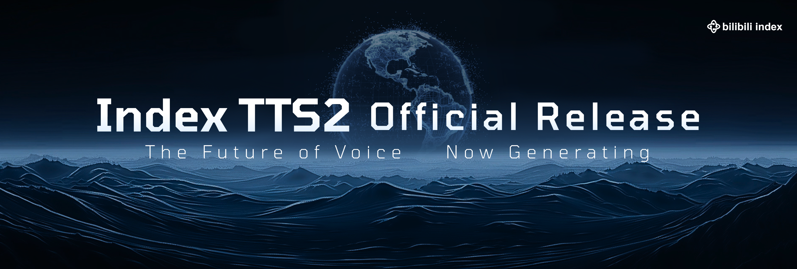
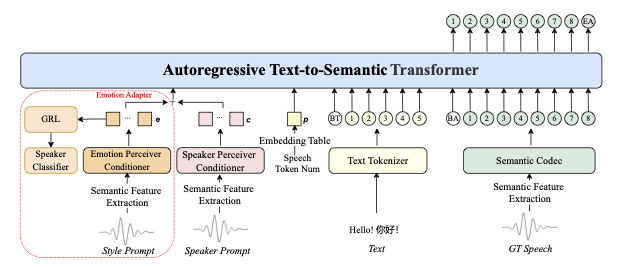

<div align="center">

</div>

<div align="center">
<a href="README_zh.md" style="font-size: 24px">简体中文</a> | 
<a href="../README.md" style="font-size: 24px">English</a>
</div>

##  👉🏻 IndexTTS2 👈🏻

<center><h3>IndexTTS2：情感表达与时长可控的自回归零样本语音合成突破</h3></center>

[](../assets/IndexTTS2_banner.png)

<div align="center">
  <a href='https://arxiv.org/abs/2506.21619'>
    
  </a>
  <br/>
  <a href='https://github.com/index-tts/index-tts'>
    
  </a>
  <a href='https://index-tts.github.io/index-tts2.github.io/'>
    
  </a>
  <br/>
  <a href='https://huggingface.co/spaces/IndexTeam/IndexTTS-2-Demo'>
    
  </a>
  <a href='https://huggingface.co/IndexTeam/IndexTTS-2'>
    
  </a>
  <br/>
  <a href='https://modelscope.cn/studios/IndexTeam/IndexTTS-2-Demo'>
    
  </>
  <a href='https://modelscope.cn/models/IndexTeam/IndexTTS-2'>
    
  </a>
</div>

### 摘要

现有自回归大规模文本转语音（TTS）模型在语音自然度方面具有优势，但其逐token生成机制难以精确控制合成语音的时长。这在需要严格视音频同步的应用（如视频配音）中成为显著限制。

本文提出了IndexTTS2，创新性地提出了一种通用且适用于自回归模型的语音时长控制方法。

该方法支持两种生成模式：一种可显式指定生成token数量以精确控制语音时长；另一种则自由自回归生成语音，同时忠实还原输入提示的韵律特征。

此外，IndexTTS2实现了情感表达与说话人身份的解耦，可独立控制音色和情感。在零样本设置下，模型能准确复刻目标音色（来自音色提示），同时完美还原指定的情感语调（来自风格提示）。

为提升高情感表达下的语音清晰度，我们引入GPT潜在表示，并设计了三阶段训练范式，提升生成语音的稳定性。为降低情感控制门槛，我们基于文本描述微调Qwen3，设计了软指令机制，有效引导语音生成所需情感。

多数据集实验结果表明，IndexTTS2在词错误率、说话人相似度和情感保真度方面均超越现有零样本TTS模型。音频样例见：<a href="https://index-tts.github.io/index-tts2.github.io/">IndexTTS2演示页面</a>。

**Tips:** 如需更多信息请联系作者。商业合作请联系 <u>indexspeech@bilibili.com</u>。

### IndexTTS2体验

<div align="center">

**IndexTTS2：语音未来，现已生成**

[](https://www.bilibili.com/video/BV136a9zqEk5)

*点击图片观看IndexTTS2介绍视频*

</div>

### 联系方式

QQ群：553460296(1群) 663272642(4群)  \
Discord：https://discord.gg/uT32E7KDmy  \
邮箱：indexspeech@bilibili.com  \
欢迎加入我们的社区！🌏  \
欢迎大家交流讨论！

## 📣 更新日志

- `2025/09/08` 🔥🔥🔥  IndexTTS-2全球发布！
    - 首个支持精确合成时长控制的自回归TTS模型，支持可控与非可控模式。<i>本版本暂未开放该功能。</i>
    - 模型实现高度情感表达的语音合成，支持多模态情感控制。
- `2025/05/14` 🔥🔥 IndexTTS-1.5发布，显著提升模型稳定性及英文表现。
- `2025/03/25` 🔥 IndexTTS-1.0发布，开放模型权重与推理代码。
- `2025/02/12` 🔥 论文提交arXiv，发布演示与测试集。

## 🖥️ 神经网络架构

IndexTTS2架构总览：

<picture>
  
</picture>

主要创新点：

 - 提出自回归TTS模型的时长自适应方案。IndexTTS2是首个将精确时长控制与自然时长生成结合的自回归零样本TTS模型，方法可扩展至任意自回归大模型。
 - 情感与说话人特征从提示中解耦，设计特征融合策略，在高情感表达下保持语义流畅与发音清晰，并开发了基于自然语言描述的情感控制工具。
 - 针对高表达性语音数据缺乏，提出高效训练策略，显著提升零样本TTS情感表达至SOTA水平。
 - 代码与预训练权重将公开，促进后续研究与应用。

## 模型下载

| **HuggingFace**                                          | **ModelScope** |
|----------------------------------------------------------|----------------------------------------------------------|
| [😁 IndexTTS-2](https://huggingface.co/IndexTeam/IndexTTS-2) | [IndexTTS-2](https://modelscope.cn/models/IndexTeam/IndexTTS-2) |
| [IndexTTS-1.5](https://huggingface.co/IndexTeam/IndexTTS-1.5) | [IndexTTS-1.5](https://modelscope.cn/models/IndexTeam/IndexTTS-1.5) |
| [IndexTTS](https://huggingface.co/IndexTeam/Index-TTS) | [IndexTTS](https://modelscope.cn/models/IndexTeam/Index-TTS) |

## 使用说明

### ⚙️ 环境配置

1. 请确保已安装 [git](https://git-scm.com/downloads) 和 [git-lfs](https://git-lfs.com/)。

在仓库中启用Git-LFS：

```bash
git lfs install
```

2. 下载代码：

```bash
git clone https://github.com/index-tts/index-tts.git && cd index-tts
git lfs pull  # 下载大文件
```

3. 安装 [uv 包管理器](https://docs.astral.sh/uv/getting-started/installation/)。
   *必须*使用uv保证依赖环境可靠。

> [!TIP]
> **快速安装方法：**
> 
> uv安装方式多样，详见官网。也可快速安装：
> 
> ```bash
> pip install -U uv
> ```

> [!WARNING]
> 本文档仅支持uv安装。其他工具如conda/pip无法保证依赖正确，可能导致*偶发bug、报错、GPU加速失效*等问题。
> 
> uv比pip快[115倍](https://github.com/astral-sh/uv/blob/main/BENCHMARKS.md)，强烈推荐。

4. 安装依赖：

使用uv安装依赖时，会创建虚拟环境，将所有依赖安装到`.venv`目录：

```bash
uv sync --all-extras
```

如中国大陆地区用户下载缓慢，可选用国内镜像：

```bash
uv sync --all-extras --default-index "https://mirrors.aliyun.com/pypi/simple"

uv sync --all-extras --default-index "https://mirrors.tuna.tsinghua.edu.cn/pypi/web/simple"
```

> [!TIP]
> **可选功能：**
> 
> - `--all-extras`：安装全部可选功能。可去除自定义。
> - `--extra webui`：安装WebUI支持（推荐）。
> - `--extra deepspeed`：安装DeepSpeed加速。

> [!IMPORTANT]
> **Windows注意：** DeepSpeed在部分Windows环境较难安装，可去除`--all-extras`。
> 
> **Linux/Windows注意：** 如遇CUDA相关报错，请确保已安装NVIDIA [CUDA Toolkit](https://developer.nvidia.com/cuda-toolkit) 12.8及以上。

5. 下载模型：

HuggingFace下载：

```bash
uv tool install "huggingface_hub[cli]"

hf download IndexTeam/IndexTTS-2 --local-dir=checkpoints
```

ModelScope下载：

```bash
uv tool install "modelscope"

modelscope download --model IndexTeam/IndexTTS-2 --local_dir checkpoints
```

> [!NOTE]
> 项目首次运行还会自动下载部分小模型。如网络访问HuggingFace较慢，建议提前设置：
> 
> ```bash
> export HF_ENDPOINT="https://hf-mirror.com"
> ```

#### 🖥️ PyTorch GPU 加速检测

可运行脚本检测机器是否有GPU，以及是否安装了GPU版本的PyTorch。（如PyTorch版本不对，可能使用CPU启动，推理会非常慢）

```bash
uv run tools/gpu_check.py
```

### 🔥 IndexTTS2快速体验

#### 🌐 Web演示

```bash
uv run webui.py
```

浏览器访问 `http://127.0.0.1:7860` 查看演示。

可通过命令行参数开启FP16推理（降低显存占用）、DeepSpeed加速、CUDA内核编译加速等。可运行以下命令查看所有选项：

```bash
uv run webui.py -h
```

祝使用愉快！

#### 📝 Python脚本调用

用`uv run <file.py>`保证程序在uv创建的虚拟环境下运行。部分情况需要指定`PYTHONPATH`。

示例：

```bash
PYTHONPATH="$PYTHONPATH:." uv run indextts/infer_v2.py
```

以下为IndexTTS2脚本调用示例：

1. 单一参考音频（音色克隆）：

```python
from indextts.infer_v2 import IndexTTS2
tts = IndexTTS2(cfg_path="checkpoints/config.yaml", model_dir="checkpoints", use_fp16=False, use_cuda_kernel=False, use_deepspeed=False)
text = "Translate for me, what is a surprise!"
tts.infer(spk_audio_prompt='examples/voice_01.wav', text=text, output_path="gen.wav", verbose=True)
```

2. 指定情感参考音频：

```python
from indextts.infer_v2 import IndexTTS2
tts = IndexTTS2(cfg_path="checkpoints/config.yaml", model_dir="checkpoints", use_fp16=False, use_cuda_kernel=False, use_deepspeed=False)
text = "酒楼丧尽天良，开始借机竞拍房间，哎，一群蠢货。"
tts.infer(spk_audio_prompt='examples/voice_07.wav', text=text, output_path="gen.wav", emo_audio_prompt="examples/emo_sad.wav", verbose=True)
```

3. 可调节情感参考音频的权重（`emo_alpha`，范围0.0-1.0，默认1.0）：

```python
from indextts.infer_v2 import IndexTTS2
tts = IndexTTS2(cfg_path="checkpoints/config.yaml", model_dir="checkpoints", use_fp16=False, use_cuda_kernel=False, use_deepspeed=False)
text = "酒楼丧尽天良，开始借机竞拍房间，哎，一群蠢货。"
tts.infer(spk_audio_prompt='examples/voice_07.wav', text=text, output_path="gen.wav", emo_audio_prompt="examples/emo_sad.wav", emo_alpha=0.9, verbose=True)
```

4. 可直接指定8维情感向量 `[高兴, 愤怒, 悲伤, 害怕, 厌恶, 忧郁, 惊讶, 平静]`，可用`use_random`开启随机情感采样（默认False）：

> [!NOTE]
> 开启随机采样会降低音色的还原度。

```python
from indextts.infer_v2 import IndexTTS2
tts = IndexTTS2(cfg_path="checkpoints/config.yaml", model_dir="checkpoints", use_fp16=False, use_cuda_kernel=False, use_deepspeed=False)
text = "哇塞！这个爆率也太高了！欧皇附体了！"
tts.infer(spk_audio_prompt='examples/voice_10.wav', text=text, output_path="gen.wav", emo_vector=[0, 0, 0, 0, 0, 0, 0.45, 0], use_random=False, verbose=True)
```

5. 可用`use_emo_text`根据文本自动生成情感向量，可用`use_random`开启随机情感采样：

```python
from indextts.infer_v2 import IndexTTS2
tts = IndexTTS2(cfg_path="checkpoints/config.yaml", model_dir="checkpoints", use_fp16=False, use_cuda_kernel=False, use_deepspeed=False)
text = "快躲起来！是他要来了！他要来抓我们了！"
tts.infer(spk_audio_prompt='examples/voice_12.wav', text=text, output_path="gen.wav", emo_alpha=0.6, use_emo_text=True, use_random=False, verbose=True)
```

6. 可直接指定情感文本描述（`emo_text`），实现文本与情感分离控制：

```python
from indextts.infer_v2 import IndexTTS2
tts = IndexTTS2(cfg_path="checkpoints/config.yaml", model_dir="checkpoints", use_fp16=False, use_cuda_kernel=False, use_deepspeed=False)
text = "快躲起来！是他要来了！他要来抓我们了！"
emo_text = "你吓死我了！你是鬼吗？"
tts.infer(spk_audio_prompt='examples/voice_12.wav', text=text, output_path="gen.wav", emo_alpha=0.6, use_emo_text=True, emo_text=emo_text, use_random=False, verbose=True)
```

> [!TIP]
> **拼音使用注意事项:**
> 
> IndexTTS2依然支持中文字符与拼音混合建模。
> 在使用时，如果需要精确的发音控制，请输入包含特定拼音标注的文本来触发拼音控制功能。
> 需要注意的是：拼音控制并不是对所有声母韵母（辅音、元音）组合都生效，系统仅保留中文合法拼音的发音。
> 具体合法情况可参考项目中的`checkpoints/pinyin.vocab`文件。
>
> 参考样例:
> ```
> 之前你做DE5很好，所以这一次也DEI3做DE2很好才XING2，如果这次目标完成得不错的话，我们就直接打DI1去银行取钱。
> ```

### 旧版IndexTTS1使用指南

如果需要使用旧的IndexTTS1.5模型，可以import旧模块：

```python
from indextts.infer import IndexTTS
tts = IndexTTS(model_dir="checkpoints",cfg_path="checkpoints/config.yaml")
voice = "examples/voice_07.wav"
text = "大家好，我现在正在bilibili 体验 ai 科技，说实话，来之前我绝对想不到！AI技术已经发展到这样匪夷所思的地步了！比如说，现在正在说话的其实是B站为我现场复刻的数字分身，简直就是平行宇宙的另一个我了。如果大家也想体验更多深入的AIGC功能，可以访问 bilibili studio，相信我，你们也会吃惊的。"
tts.infer(voice, text, 'gen.wav')
```

详细信息见 [README_INDEXTTS_1_5](archive/README_INDEXTTS_1_5.md)，或访问 <a href="https://github.com/index-tts/index-tts/tree/v1.5.0">index-tts:v1.5.0</a>。

## 演示

### IndexTTS2: [[论文]](https://arxiv.org/abs/2506.21619); [[演示]](https://index-tts.github.io/index-tts2.github.io/); [[ModelScope]](https://modelscope.cn/studios/IndexTeam/IndexTTS-2-Demo); [[HuggingFace]](https://huggingface.co/spaces/IndexTeam/IndexTTS-2-Demo)

### IndexTTS1: [[论文]](https://arxiv.org/abs/2502.05512); [[演示]](https://index-tts.github.io/); [[ModelScope]](https://modelscope.cn/studios/IndexTeam/IndexTTS-Demo); [[HuggingFace]](https://huggingface.co/spaces/IndexTeam/IndexTTS)

## 致谢

1. [tortoise-tts](https://github.com/neonbjb/tortoise-tts)
2. [XTTSv2](https://github.com/coqui-ai/TTS)
3. [BigVGAN](https://github.com/NVIDIA/BigVGAN)
4. [wenet](https://github.com/wenet-e2e/wenet/tree/main)
5. [icefall](https://github.com/k2-fsa/icefall)
6. [maskgct](https://github.com/open-mmlab/Amphion/tree/main/models/tts/maskgct)
7. [seed-vc](https://github.com/Plachtaa/seed-vc)

## 📚 论文引用

🌟 如果本项目对您有帮助，请为我们点star并引用论文。

IndexTTS2:

```
@article{zhou2025indextts2,
  title={IndexTTS2: A Breakthrough in Emotionally Expressive and Duration-Controlled Auto-Regressive Zero-Shot Text-to-Speech},
  author={Siyi Zhou, Yiquan Zhou, Yi He, Xun Zhou, Jinchao Wang, Wei Deng, Jingchen Shu},
  journal={arXiv preprint arXiv:2506.21619},
  year={2025}
}
```

IndexTTS:

```
@article{deng2025indextts,
  title={IndexTTS: An Industrial-Level Controllable and Efficient Zero-Shot Text-To-Speech System},
  author={Wei Deng, Siyi Zhou, Jingchen Shu, Jinchao Wang, Lu Wang},
  journal={arXiv preprint arXiv:2502.05512},
  year={2025},
  doi={10.48550/arXiv.2502.05512},
  url={https://arxiv.org/abs/2502.05512}
}
```

